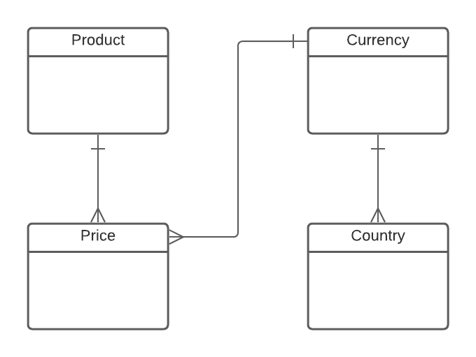

# International Pricebook Challenge

- Basically the ideia of the challenge is to create an API that is capable to handle products with different prices based on different currencies.

## Database Structure

The postgres database was used to store all the informations about the products and its prices as the following:

### Tables:
- Product
- Price
- Currency
- Country

### Relations:
- A product may have several prices
- A price can only be associated to 1 product and 1 currency
- A currency can be associated to many prices and many countries

### Entity Relationship Diagram



## Requirements

The only requirement to run the project is to have Docker up and running

## How to Run

### Preparing env variables
- Create a `.env` file based on the `.env.example`
- On the first run it is recomended to set the variable INSERT_SAMPLE_DATA as true, so some sample data will be created in the database.

### Running the application
- First install the application by running

```
make install
```

- Run the application by running the command below

```
make run
```
- Stop the application by running the command below:
```
make stop
```
### Testing the application

- You can run the tests by running the command:
```
make tests
```

### Testing the application via rest interface

There are basically 9 endpoints that can be used to test the application:

- Creating a currency
```
POST
endpoint: http://localhost:9000/currency
body: {"name":"Real", "acronym":"BRL"}
```

- Find a currency
```
GET
endpoint: http://localhost:9000/currency/{id}
```

- Find all currencies
```
GET
endpoint: http://localhost:9000/currencies
body: {"name":"Real", "acronym":"BRL"}
```

- Creating a country
```
POST
endpoint: http://localhost:9000/country
body: {"name":"Brasil", "abbreviation":"BRA", "currency_id":"<currency_uuid>"}
```

- Find a country
```
GET
endpoint: http://localhost:9000/country/{id}
```

- Find all countries
```
endpoint: http://localhost:9000/countries
```

- Creating a product
```
POST
endpoint: http://localhost:9000/product
body: {"name":"Brasil", "price": 259.90, "currency_id":"<currency_uuid>"}
```

- Find a product
```
GET
endpoint: http://localhost:9000/product/{id}
```

- Find all products
```
endpoint: http://localhost:9000/products
```

- Adding new price to the product
```
POST
endpoint: http://localhost:9000/price
body: {"product_id":"<product_uuid>", "currency_id":"<currency_uuid>", "price": 399.90}
```